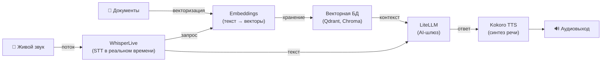

[English](README.md) | [简体中文](README-zh.md) | [繁體中文](README-zh-Hant.md) | [Русский](README-ru.md)

# WhisperLive — Распознавание речи в реальном времени на Docker

[](https://github.com/hwdsl2/docker-whisper-live/actions/workflows/main.yml) &nbsp;[](https://opensource.org/licenses/MIT)

Docker-образ для запуска сервера [WhisperLive](https://github.com/collabora/WhisperLive) с транскрибированием речи в реальном времени на базе [faster-whisper](https://github.com/SYSTRAN/faster-whisper). Предоставляет **потоковую передачу через WebSocket** для распознавания живого аудио и **совместимый с OpenAI REST API** для транскрибирования файлов. Основан на Debian (python:3.12-slim). Простой, приватный, для самостоятельного развёртывания.

**Возможности:**

- Потоковая передача через WebSocket в реальном времени — транскрибирование живого аудио с микрофона или потоков с минимальной задержкой
- Совместимый с OpenAI REST API — `POST /v1/audio/transcriptions` для файлового транскрибирования; любое приложение, использующее OpenAI Whisper API, переключается одной строкой
- Поддержка всех моделей Whisper: `tiny`, `base`, `small`, `medium`, `large-v3`, `large-v3-turbo` и других
- Обнаружение голосовой активности (VAD) — автоматически пропускает тишину для более быстрого и чистого транскрибирования
- Управление моделями через вспомогательный скрипт (`whisper_live_manage`)
- Аудио остаётся на вашем сервере — данные не передаются третьим сторонам
- Офлайн-режим — работа без доступа к интернету с предварительно загруженными моделями (`WHISPERLIVE_LOCAL_ONLY`)
- Автоматическая сборка и публикация через [GitHub Actions](https://github.com/hwdsl2/docker-whisper-live/actions/workflows/main.yml)
- Постоянный кэш моделей в Docker-томе, совместимый с `docker-whisper`
- Мультиархитектурная поддержка: `linux/amd64`, `linux/arm64`

**Также доступно:**

- ИИ/Аудио: [Whisper (пакетный STT)](https://github.com/hwdsl2/docker-whisper/blob/main/README-ru.md), [Kokoro (TTS)](https://github.com/hwdsl2/docker-kokoro/blob/main/README-ru.md), [Embeddings](https://github.com/hwdsl2/docker-embeddings/blob/main/README-ru.md), [LiteLLM](https://github.com/hwdsl2/docker-litellm/blob/main/README-ru.md)
- VPN: [WireGuard](https://github.com/hwdsl2/docker-wireguard/blob/main/README-ru.md), [OpenVPN](https://github.com/hwdsl2/docker-openvpn/blob/main/README-ru.md), [IPsec VPN](https://github.com/hwdsl2/docker-ipsec-vpn-server/blob/master/README-ru.md), [Headscale](https://github.com/hwdsl2/docker-headscale/blob/main/README-ru.md)

**Подсказка:** WhisperLive, Whisper, Kokoro, Embeddings и LiteLLM можно [использовать совместно](#использование-с-другими-ai-сервисами) для построения полного приватного AI-стека на собственном сервере.

## WhisperLive или Whisper?

| | [docker-whisper](https://github.com/hwdsl2/docker-whisper/blob/main/README-ru.md) | **docker-whisper-live** |
|---|---|---|
| **Назначение** | Транскрибирование готовых аудиофайлов | Живой микрофон / потоковое аудио в реальном времени |
| **Протокол** | HTTP REST | WebSocket (потоковый) + HTTP REST |
| **Задержка** | Ответ после обработки всего файла | Почти мгновенно, слово за словом |
| **Подходит для** | Записи совещаний, загруженные аудиофайлы | Захват в браузере, RTSP-потоки, живые субтитры |
| **Размер образа** | ~180 МБ | ~800 МБ (включает PyTorch для VAD) |

## Быстрый старт

Запустите сервер WhisperLive:

```bash
docker run \
    --name whisper-live \
    --restart=always \
    -v whisper-live-data:/var/lib/whisper-live \
    -p 9090:9090 \
    -p 8000:8000 \
    -d hwdsl2/whisper-live-server
```

**Примечание:** Для развёртывания с доступом из интернета **настоятельно рекомендуется** использовать [обратный прокси](#использование-обратного-прокси) для добавления HTTPS. В этом случае также замените `-p 9090:9090 -p 8000:8000` на `-p 127.0.0.1:9090:9090 -p 127.0.0.1:8000:8000`.

При первом подключении клиента модель Whisper `base` (~145 МБ) скачивается и кэшируется. Проверьте логи:

```bash
docker logs whisper-live
```

После появления "WhisperLive real-time transcription server is ready":

**Подключение WebSocket-клиента в реальном времени:**

```
ws://ip_вашего_сервера:9090
```

**Или транскрибирование файла через REST API:**

```bash
curl http://ip_вашего_сервера:8000/v1/audio/transcriptions \
    -F file=@audio.mp3 \
    -F model=whisper-1
```

**Ответ:**
```json
{"text": "Транскрибированный текст появляется здесь."}
```

## Требования

- Сервер Linux (локальный или облачный) с установленным Docker
- Поддерживаемые архитектуры: `amd64` (x86_64), `arm64` (например, Raspberry Pi 4/5, AWS Graviton)
- Минимум ОЗУ: ~1,5 ГБ свободной памяти (PyTorch + модель base). Сам образ ~2 ГБ (сжатый).
- Доступ к интернету для первоначальной загрузки модели (после чего она кэшируется локально). Не требуется при использовании `WHISPERLIVE_LOCAL_ONLY=true` с предварительно загруженными моделями.
- **Только CPU:** Этот образ работает исключительно на CPU. Модели `tiny` и `base` хорошо справляются с потоковой передачей через WebSocket в реальном времени на CPU. Модели `small` и крупнее работают медленнее на CPU и могут не успевать за живым аудиопотоком — используйте их только если точность транскрибирования важнее задержки в реальном времени.

## Загрузка

Получить проверенную сборку из [Docker Hub](https://hub.docker.com/r/hwdsl2/whisper-live-server/):

```bash
docker pull hwdsl2/whisper-live-server
```

Или из [Quay.io](https://quay.io/repository/hwdsl2/whisper-live-server):

```bash
docker pull quay.io/hwdsl2/whisper-live-server
docker image tag quay.io/hwdsl2/whisper-live-server hwdsl2/whisper-live-server
```

Поддерживаемые платформы: `linux/amd64` и `linux/arm64`.

## Переменные окружения

Все переменные необязательны. При отсутствии используются безопасные значения по умолчанию.

| Переменная | Описание | По умолчанию |
|---|---|---|
| `WHISPERLIVE_MODEL` | Модель Whisper. См. [таблицу моделей](#смена-модели). | `base` |
| `WHISPERLIVE_LANGUAGE` | Язык транскрибирования по умолчанию. Код BCP-47 (например, `ru`, `en`) или `auto` для автоопределения. | `auto` |
| `WHISPERLIVE_PORT` | Порт WebSocket для потоковых клиентов (1–65535). | `9090` |
| `WHISPERLIVE_REST_PORT` | HTTP-порт совместимого с OpenAI REST API (1–65535). | `8000` |
| `WHISPERLIVE_MAX_CLIENTS` | Максимальное количество одновременных WebSocket-подключений. | `4` |
| `WHISPERLIVE_MAX_CONNECTION_TIME` | Максимальная длительность WebSocket-подключения в секундах. | `600` |
| `WHISPERLIVE_USE_VAD` | Включить обнаружение голосовой активности. `true` — пропускать тишину, `false` — обрабатывать всё аудио непрерывно. | `true` |
| `WHISPERLIVE_THREADS` | Потоки CPU для инференса. Установите равным количеству физических ядер для минимальной задержки. | `2` |
| `WHISPERLIVE_LOG_LEVEL` | Уровень логирования: `DEBUG`, `INFO`, `WARNING`, `ERROR`, `CRITICAL`. | `INFO` |
| `WHISPERLIVE_LOCAL_ONLY` | При установке любого непустого значения (например, `true`) отключает загрузку моделей с HuggingFace. Для офлайн-развёртываний. | *(не задано)* |

Пример использования env-файла:

```bash
cp whisper-live.env.example whisper-live.env
# Отредактируйте whisper-live.env и запустите:
docker run \
    --name whisper-live \
    --restart=always \
    -v whisper-live-data:/var/lib/whisper-live \
    -v ./whisper-live.env:/whisper-live.env:ro \
    -p 9090:9090 \
    -p 8000:8000 \
    -d hwdsl2/whisper-live-server
```

## Использование docker-compose

```bash
cp whisper-live.env.example whisper-live.env
docker compose up -d
docker logs whisper-live
```

## Потоковая передача через WebSocket

WebSocket-эндпоинт на порту `9090` поддерживает транскрибирование живых аудиопотоков.

При подключении сначала отправьте JSON-конфигурацию:

```json
{
  "uid": "unique-client-id",
  "language": "ru",
  "model": "base",
  "use_vad": true
}
```

Затем передавайте сырое 16-битное PCM-аудио на частоте 16 кГц бинарными WebSocket-фреймами. Сервер возвращает JSON-события транскрибирования:

```json
{"uid": "unique-client-id", "segments": [{"text": "Привет, как дела?", "start": 0.0, "end": 2.4, "completed": true}]}
```

### Пример Python-клиента

```python
from whisper_live.client import TranscriptionClient

client = TranscriptionClient(
    "ip_вашего_сервера",
    9090,
    lang="ru",
    translate=False,
    model="base",
    use_vad=True,
)

# Транскрибирование файла
client("audio.mp3")

# Или с микрофона
# client()
```

Установка клиентской библиотеки:

```bash
pip install whisper-live
```

## REST API

REST API на порту `8000` полностью совместим с [эндпоинтом OpenAI для транскрибирования аудио](https://developers.openai.com/api/reference/resources/audio/subresources/transcriptions/methods/create).

```bash
curl http://ip_вашего_сервера:8000/v1/audio/transcriptions \
    -F file=@meeting.m4a \
    -F model=whisper-1 \
    -F language=ru
```

Интерактивная документация Swagger UI:

```
http://ip_вашего_сервера:8000/docs
```

## Постоянные данные

Все данные сервера хранятся в Docker-томе (`/var/lib/whisper-live` внутри контейнера):

```
/var/lib/whisper-live/
├── models--Systran--faster-whisper-*/   # Кэшированные файлы модели Whisper (загружены с HuggingFace)
├── .port                 # Активный порт WebSocket (используется whisper_live_manage)
├── .rest_port            # Активный порт REST API (используется whisper_live_manage)
├── .model                # Активное имя модели (используется whisper_live_manage)
└── .server_addr          # Кэшированный IP сервера (используется whisper_live_manage)
```

**Совет:** Том `/var/lib/whisper-live` использует ту же схему кэша HuggingFace, что и том `/var/lib/whisper` проекта `docker-whisper`. Если вы уже скачали модель с помощью `docker-whisper`, можно примонтировать тот же каталог тома, чтобы избежать повторной загрузки.

Загруженные модели сохраняются в томе `whisper-live-data`. Создавайте резервные копии Docker-тома для сохранения загруженных моделей. Модели занимают от 145 МБ до 3 ГБ и могут загружаться несколько минут при первом подключении клиента; сохранение тома позволяет избежать повторной загрузки при пересоздании контейнера.

## Управление сервером

```bash
docker exec whisper-live whisper_live_manage --showinfo
docker exec whisper-live whisper_live_manage --listmodels
docker exec whisper-live whisper_live_manage --downloadmodel large-v3-turbo
```

## Смена модели

1. *(Опционально, но рекомендуется)* Предварительно скачайте новую модель:
   ```bash
   docker exec whisper-live whisper_live_manage --downloadmodel large-v3-turbo
   ```
2. Обновите `WHISPERLIVE_MODEL` в файле `whisper-live.env`.
3. Перезапустите контейнер:
   ```bash
   docker restart whisper-live
   ```

## Использование обратного прокси

Используйте один из следующих адресов для доступа к контейнеру из обратного прокси:

- **`whisper-live:9090`** / **`whisper-live:8000`** — если обратный прокси работает как контейнер в **той же Docker-сети**.
- **`127.0.0.1:9090`** / **`127.0.0.1:8000`** — если обратный прокси работает **на хосте** и порты опубликованы.

**Пример с [Caddy](https://caddyserver.com/docs/) ([Docker-образ](https://hub.docker.com/_/caddy))** (автоматический TLS, проксирование WebSocket в той же Docker-сети):

`Caddyfile`:
```
whisper-live.example.com {
  # WebSocket-поток (wss://)
  handle /ws* {
    reverse_proxy whisper-live:9090
  }
  # REST API (https://)
  reverse_proxy whisper-live:8000
}
```

**Пример с nginx** (обратный прокси на хосте):

```nginx
server {
    listen 443 ssl;
    server_name whisper-live.example.com;

    ssl_certificate     /path/to/cert.pem;
    ssl_certificate_key /path/to/key.pem;

    # REST API
    location /v1/ {
        proxy_pass         http://127.0.0.1:8000;
        proxy_set_header   Host $host;
        proxy_read_timeout 300s;
    }

    # WebSocket-поток
    location / {
        proxy_pass         http://127.0.0.1:9090;
        proxy_http_version 1.1;
        proxy_set_header   Upgrade $http_upgrade;
        proxy_set_header   Connection "upgrade";
        proxy_set_header   Host $host;
        proxy_read_timeout 600s;
    }
}
```

> **Важно:** Для проксирования WebSocket необходимы `proxy_http_version 1.1` и заголовки `Upgrade`/`Connection`. Без них потоковая передача в реальном времени через nginx работать не будет.

## Обновление Docker-образа

```bash
docker pull hwdsl2/whisper-live-server
docker rm -f whisper-live
# Затем повторно выполните команду docker run из раздела «Быстрый старт» с теми же томами и портами.
```

Загруженные модели сохраняются в томе `whisper-live-data`.

## Использование с другими AI-сервисами

[WhisperLive (STT в реальном времени)](https://github.com/hwdsl2/docker-whisper-live/blob/main/README-ru.md), [Whisper (пакетный STT)](https://github.com/hwdsl2/docker-whisper/blob/main/README-ru.md), [Embeddings](https://github.com/hwdsl2/docker-embeddings/blob/main/README-ru.md), [LiteLLM](https://github.com/hwdsl2/docker-litellm/blob/main/README-ru.md) и [Kokoro (TTS)](https://github.com/hwdsl2/docker-kokoro/blob/main/README-ru.md) можно объединить для построения полного приватного AI-стека на собственном сервере. При использовании LiteLLM с внешними провайдерами (например, OpenAI, Anthropic) ваши данные будут переданы этим провайдерам.



| Сервис | Назначение | Порт по умолчанию |
|---|---|---|
| **[WhisperLive (STT в реальном времени)](https://github.com/hwdsl2/docker-whisper-live/blob/main/README-ru.md)** | Потоковое транскрибирование через WebSocket | `9090` (WS), `8000` (REST) |
| **[Whisper (пакетный STT)](https://github.com/hwdsl2/docker-whisper/blob/main/README-ru.md)** | Транскрибирование готовых аудиофайлов через REST API | `9000` |
| **[Embeddings](https://github.com/hwdsl2/docker-embeddings/blob/main/README-ru.md)** | Преобразование текста в векторы для семантического поиска и RAG | `8000` |
| **[LiteLLM](https://github.com/hwdsl2/docker-litellm/blob/main/README-ru.md)** | AI-шлюз — маршрутизация запросов к OpenAI, Anthropic, Ollama и 100+ другим провайдерам | `4000` |
| **[Kokoro (TTS)](https://github.com/hwdsl2/docker-kokoro/blob/main/README-ru.md)** | Преобразование текста в естественную речь | `8880` |

### Пример RAG-конвейера

Векторизация документов для семантического поиска, извлечение контекста и ответы на вопросы с помощью LLM:

```bash
# Шаг 1: Векторизуем фрагмент документа и сохраняем в векторную БД
curl -s http://localhost:8000/v1/embeddings \
    -H "Content-Type: application/json" \
    -d '{"input": "Docker упрощает развёртывание, упаковывая приложения в контейнеры.", "model": "text-embedding-ada-002"}' \
    | jq '.data[0].embedding'
# → Сохраните возвращённый вектор вместе с исходным текстом в Qdrant, Chroma, pgvector и т. д.

# Шаг 2: При запросе векторизуем вопрос, извлекаем наиболее релевантные фрагменты
#          из векторной БД, затем передаём вопрос и контекст в LiteLLM.
curl -s http://localhost:4000/v1/chat/completions \
    -H "Authorization: Bearer <your-litellm-key>" \
    -H "Content-Type: application/json" \
    -d '{
      "model": "gpt-4o",
      "messages": [
        {"role": "system", "content": "Отвечай только на основе предоставленного контекста."},
        {"role": "user", "content": "Что делает Docker?\n\nКонтекст: Docker упрощает развёртывание, упаковывая приложения в контейнеры."}
      ]
    }' \
    | jq -r '.choices[0].message.content'
```

### Пример конвейера живого голоса

Транскрибирование речи в реальном времени с передачей в LLM:

```bash
# Установите клиентскую библиотеку
pip install whisper-live openai

# Потоковая передача с микрофона, вывод каждого сегмента, отправка в LLM
python3 - <<'EOF'
from whisper_live.client import TranscriptionClient
from openai import OpenAI

llm = OpenAI(base_url="http://localhost:4000", api_key="your-litellm-key")

def on_segment(segments):
    for seg in segments:
        if seg.get("completed"):
            text = seg["text"].strip()
            print(f"Транскрипция: {text}")
            resp = llm.chat.completions.create(
                model="gpt-4o",
                messages=[{"role": "user", "content": text}],
            )
            print(f"LLM: {resp.choices[0].message.content}")

client = TranscriptionClient("localhost", 9090, lang="ru", model="base", use_vad=True)
client()
EOF
```

## Техническая информация

- Базовый образ: `python:3.12-slim` (Debian)
- Среда выполнения: Python 3 (виртуальное окружение в `/opt/venv`)
- STT-движок: [WhisperLive](https://github.com/collabora/WhisperLive) + [faster-whisper](https://github.com/SYSTRAN/faster-whisper) с CTranslate2 (INT8 по умолчанию)
- VAD: [Silero VAD](https://github.com/snakers4/silero-vad) через PyTorch (CPU)
- WebSocket-сервер: библиотека Python `websockets`
- REST API: [FastAPI](https://fastapi.tiangolo.com/) + [Uvicorn](https://www.uvicorn.org/)
- Директория данных: `/var/lib/whisper-live` (Docker-том)
- Хранение моделей: формат HuggingFace Hub внутри тома — загружается один раз, переиспользуется при перезапусках

## Лицензия

**Примечание:** Программные компоненты внутри готового образа (такие как WhisperLive, faster-whisper, PyTorch и их зависимости) распространяются под соответствующими лицензиями, выбранными их правообладателями. При использовании готового образа пользователь несёт ответственность за соблюдение всех применимых лицензий.

Copyright (C) 2026 Lin Song   
Данная работа распространяется под [лицензией MIT](https://opensource.org/licenses/MIT).

**WhisperLive** является собственностью Vineet Suryan, Collabora Ltd. и распространяется под [лицензией MIT](https://github.com/collabora/WhisperLive/blob/main/LICENSE).

**faster-whisper** является собственностью SYSTRAN и распространяется под [лицензией MIT](https://github.com/SYSTRAN/faster-whisper/blob/master/LICENSE).

Данный проект является независимой Docker-обёрткой и не связан с OpenAI, Collabora или SYSTRAN, не одобрен и не спонсируется ими.

