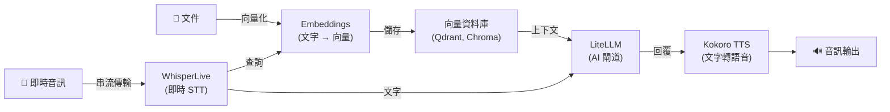

[English](README.md) | [简体中文](README-zh.md) | [繁體中文](README-zh-Hant.md) | [Русский](README-ru.md)

# WhisperLive 即時語音轉文字 Docker 映像

[](https://github.com/hwdsl2/docker-whisper-live/actions/workflows/main.yml) &nbsp;[](https://opensource.org/licenses/MIT)

使用 [faster-whisper](https://github.com/SYSTRAN/faster-whisper) 在 Docker 容器中執行 [WhisperLive](https://github.com/collabora/WhisperLive) 即時語音轉文字伺服器。提供用於即時音訊轉錄的 **WebSocket 串流**，以及用於檔案轉錄的 **OpenAI 相容 REST API**。基於 Debian (python:3.12-slim)，簡單、私密、可自架。

**功能特色：**

- 即時 WebSocket 串流 — 以近乎即時的方式轉錄即時麥克風音訊或音訊串流
- OpenAI 相容 REST API — 提供 `POST /v1/audio/transcriptions` 檔案轉錄端點；任何呼叫 OpenAI Whisper API 的應用程式只需修改一行設定即可切換
- 支援所有 Whisper 模型：`tiny`、`base`、`small`、`medium`、`large-v3`、`large-v3-turbo` 等
- 語音活動偵測（VAD）— 自動略過靜音段，實現更快、更乾淨的轉錄
- 透過輔助腳本 (`whisper_live_manage`) 管理模型
- 音訊資料保留在您的伺服器上，不傳送給第三方
- 離線/隔離網路模式 — 使用預先快取的模型，無需網際網路存取 (`WHISPERLIVE_LOCAL_ONLY`)
- 透過 [GitHub Actions](https://github.com/hwdsl2/docker-whisper-live/actions/workflows/main.yml) 自動建置和發佈
- 透過 Docker 資料卷持久化模型快取，與 `docker-whisper` 快取配置相容
- 多架構支援：`linux/amd64`、`linux/arm64`

**另提供：**

- AI/音訊：[Whisper（批次 STT）](https://github.com/hwdsl2/docker-whisper/blob/main/README-zh-Hant.md)、[Kokoro (TTS)](https://github.com/hwdsl2/docker-kokoro/blob/main/README-zh-Hant.md)、[Embeddings](https://github.com/hwdsl2/docker-embeddings/blob/main/README-zh-Hant.md)、[LiteLLM](https://github.com/hwdsl2/docker-litellm/blob/main/README-zh-Hant.md)
- VPN：[WireGuard](https://github.com/hwdsl2/docker-wireguard/blob/main/README-zh-Hant.md)、[OpenVPN](https://github.com/hwdsl2/docker-openvpn/blob/main/README-zh-Hant.md)、[IPsec VPN](https://github.com/hwdsl2/docker-ipsec-vpn-server/blob/master/README-zh-Hant.md)、[Headscale](https://github.com/hwdsl2/docker-headscale/blob/main/README-zh-Hant.md)

**提示：** WhisperLive、Whisper、Kokoro、Embeddings 和 LiteLLM 可以[搭配使用](#與其他-ai-服務搭配使用)，在您自己的伺服器上建立完整的私密 AI 系統。

## WhisperLive 與 Whisper 的選擇

| | [docker-whisper](https://github.com/hwdsl2/docker-whisper/blob/main/README-zh-Hant.md) | **docker-whisper-live** |
|---|---|---|
| **使用情境** | 轉錄完整音訊檔案 | 即時麥克風/音訊串流 |
| **協定** | HTTP REST | WebSocket（串流）+ HTTP REST |
| **延遲** | 完整檔案處理後回傳結果 | 近即時，逐字輸出 |
| **適合** | 會議錄音、上傳的音訊檔案 | 瀏覽器擷取、RTSP 串流、即時字幕 |
| **映像大小** | ~180 MB | ~800 MB（包含用於 VAD 的 PyTorch） |

## 快速開始

使用以下指令啟動 WhisperLive 伺服器：

```bash
docker run \
    --name whisper-live \
    --restart=always \
    -v whisper-live-data:/var/lib/whisper-live \
    -p 9090:9090 \
    -p 8000:8000 \
    -d hwdsl2/whisper-live-server
```

**注意：** 如需面向網際網路的部署，**強烈建議**使用[反向代理](#使用反向代理)來新增 HTTPS。此時，還應將上述 `docker run` 指令中的 `-p 9090:9090 -p 8000:8000` 替換為 `-p 127.0.0.1:9090:9090 -p 127.0.0.1:8000:8000`，以防止從外部直接存取未加密的連接埠。

首次用戶端連線時，Whisper `base` 模型（約 145 MB）將自動下載並快取。查看記錄確認伺服器已就緒：

```bash
docker logs whisper-live
```

看到 "WhisperLive real-time transcription server is ready" 後：

**連接即時 WebSocket 用戶端：**

```
ws://您的伺服器IP:9090
```

**或透過 REST API 轉錄檔案：**

```bash
curl http://您的伺服器IP:8000/v1/audio/transcriptions \
    -F file=@audio.mp3 \
    -F model=whisper-1
```

**回應：**
```json
{"text": "轉錄的文字內容顯示在這裡。"}
```

## 系統需求

- 已安裝 Docker 的 Linux 伺服器（本地或雲端）
- 支援的架構：`amd64`（x86_64）、`arm64`（例如 Raspberry Pi 4/5、AWS Graviton）
- 最低記憶體：約需 1.5 GB 可用記憶體（PyTorch + base 模型）。映像本身約 2 GB（壓縮後）。
- 首次啟動需要存取網際網路以下載模型（之後模型將快取在本地）。使用預先快取的模型並設定 `WHISPERLIVE_LOCAL_ONLY=true` 時不需要網路存取。
- **僅 CPU 映像：** 本映像僅支援 CPU 執行。`tiny` 和 `base` 模型在 CPU 上可滿足即時 WebSocket 串流的需求。`small` 及更大的模型在 CPU 上速度較慢，可能無法即時跟上音訊串流——僅在轉錄精確度比即時延遲更重要時使用這些模型。

如需面向公網部署，請參閱[使用反向代理](#使用反向代理)以啟用 HTTPS。

## 下載

從 [Docker Hub](https://hub.docker.com/r/hwdsl2/whisper-live-server/) 取得可信任的建置版本：

```bash
docker pull hwdsl2/whisper-live-server
```

也可從 [Quay.io](https://quay.io/repository/hwdsl2/whisper-live-server) 下載：

```bash
docker pull quay.io/hwdsl2/whisper-live-server
docker image tag quay.io/hwdsl2/whisper-live-server hwdsl2/whisper-live-server
```

支援平台：`linux/amd64` 和 `linux/arm64`。

## 環境變數

所有變數均為選填。如未設定，將自動使用安全的預設值。

此 Docker 映像使用以下變數，可在 `env` 檔案中宣告（參見[範例](whisper-live.env.example)）：

| 變數 | 說明 | 預設值 |
|---|---|---|
| `WHISPERLIVE_MODEL` | 使用的 Whisper 模型。請參閱[模型清單](#切換模型)。 | `base` |
| `WHISPERLIVE_LANGUAGE` | 預設轉錄語言。使用 BCP-47 語言代碼（如 `zh`、`en`、`ja`）或 `auto` 自動偵測。 | `auto` |
| `WHISPERLIVE_PORT` | 即時串流用戶端的 WebSocket 連接埠（1–65535）。 | `9090` |
| `WHISPERLIVE_REST_PORT` | OpenAI 相容 REST API 的 HTTP 連接埠（1–65535）。 | `8000` |
| `WHISPERLIVE_MAX_CLIENTS` | 最大同時 WebSocket 用戶端連線數。 | `4` |
| `WHISPERLIVE_MAX_CONNECTION_TIME` | WebSocket 最大連線時長（秒）。超過此時長的用戶端將被自動斷線。 | `600` |
| `WHISPERLIVE_USE_VAD` | 啟用語音活動偵測。設為 `true` 時自動偵測並略過靜音段。設為 `false` 持續處理所有音訊。 | `true` |
| `WHISPERLIVE_THREADS` | 推理使用的 CPU 執行緒數。設為實體核心數可獲得最佳延遲。 | `2` |
| `WHISPERLIVE_LOG_LEVEL` | 記錄層級：`DEBUG`、`INFO`、`WARNING`、`ERROR`、`CRITICAL`。 | `INFO` |
| `WHISPERLIVE_LOCAL_ONLY` | 設為任意非空值（如 `true`）時，禁止所有 HuggingFace 模型下載。適用於預先快取模型的離線或隔離網路部署。 | *（未設定）* |

**注意：** 在 `env` 檔案中，值可用單引號括起，例如 `VAR='value'`。`=` 兩側不要有空格。如更改 `WHISPERLIVE_PORT` 或 `WHISPERLIVE_REST_PORT`，請相應更新 `docker run` 指令中的 `-p` 參數。

使用 `env` 檔案的範例：

```bash
cp whisper-live.env.example whisper-live.env
# 編輯 whisper-live.env 設定您的選項，然後：
docker run \
    --name whisper-live \
    --restart=always \
    -v whisper-live-data:/var/lib/whisper-live \
    -v ./whisper-live.env:/whisper-live.env:ro \
    -p 9090:9090 \
    -p 8000:8000 \
    -d hwdsl2/whisper-live-server
```

`env` 檔案以繫結掛載方式傳入容器，每次重新啟動時自動生效，無需重建容器。

## 使用 docker-compose

```bash
cp whisper-live.env.example whisper-live.env
# 依需求編輯 whisper-live.env，然後：
docker compose up -d
docker logs whisper-live
```

## WebSocket 串流

`9090` 連接埠的 WebSocket 端點支援即時音訊串流轉錄。用戶端傳送原始 PCM 音訊區塊，伺服器在解碼時回傳轉錄段落。

連線後，首先傳送 JSON 設定訊息：

```json
{
  "uid": "unique-client-id",
  "language": "zh",
  "model": "base",
  "use_vad": true
}
```

然後以二進位 WebSocket 幀形式串流傳輸 16 kHz 取樣率的 16 位元 PCM 原始音訊。伺服器回傳 JSON 轉錄事件：

```json
{"uid": "unique-client-id", "segments": [{"text": "您好，最近怎麼樣？", "start": 0.0, "end": 2.4, "completed": true}]}
```

### Python 用戶端範例

```python
from whisper_live.client import TranscriptionClient

client = TranscriptionClient(
    "您的伺服器IP",
    9090,
    lang="zh",
    translate=False,
    model="base",
    use_vad=True,
)

# 轉錄檔案
client("audio.mp3")

# 或從麥克風轉錄
# client()
```

安裝用戶端函式庫：

```bash
pip install whisper-live
```

## REST API 參考

`8000` 連接埠的 REST API 與 [OpenAI 音訊轉錄端點](https://developers.openai.com/api/reference/resources/audio/subresources/transcriptions/methods/create)完全相容。

```bash
curl http://您的伺服器IP:8000/v1/audio/transcriptions \
    -F file=@meeting.m4a \
    -F model=whisper-1 \
    -F language=zh
```

互動式 Swagger UI 可在以下位址存取：

```
http://您的伺服器IP:8000/docs
```

## 持久化資料

所有伺服器資料儲存在 Docker 資料卷（容器內的 `/var/lib/whisper-live`）中：

```
/var/lib/whisper-live/
├── models--Systran--faster-whisper-*/   # 快取的 Whisper 模型檔案（從 HuggingFace 下載）
├── .port                 # 當前 WebSocket 連接埠（供 whisper_live_manage 使用）
├── .rest_port            # 當前 REST API 連接埠（供 whisper_live_manage 使用）
├── .model                # 當前模型名稱（供 whisper_live_manage 使用）
└── .server_addr          # 快取的伺服器 IP（供 whisper_live_manage 使用）
```

**提示：** `/var/lib/whisper-live` 資料卷與 `docker-whisper` 的 `/var/lib/whisper` 資料卷使用相同的 HuggingFace 快取配置。如果已透過 `docker-whisper` 下載了模型，可繫結掛載相同的資料卷目錄以避免重複下載。

請備份 Docker 資料卷以保留已下載的模型。模型體積較大（145 MB – 3 GB），首次用戶端連線時下載可能需要數分鐘；保留資料卷可避免在重新建立容器時重複下載。

## 管理伺服器

在執行中的容器內使用 `whisper_live_manage` 來查看和管理伺服器。

```bash
docker exec whisper-live whisper_live_manage --showinfo
docker exec whisper-live whisper_live_manage --listmodels
docker exec whisper-live whisper_live_manage --downloadmodel large-v3-turbo
```

## 切換模型

1. *（選填但建議）* 預先下載新模型：
   ```bash
   docker exec whisper-live whisper_live_manage --downloadmodel large-v3-turbo
   ```
2. 在 `whisper-live.env` 檔案中更新 `WHISPERLIVE_MODEL`。
3. 重新啟動容器：
   ```bash
   docker restart whisper-live
   ```

## 使用反向代理

可使用以下位址從反向代理存取容器：

- **`whisper-live:9090`** / **`whisper-live:8000`** — 如果反向代理以容器形式執行在**相同 Docker 網路**中。
- **`127.0.0.1:9090`** / **`127.0.0.1:8000`** — 如果反向代理執行在**主機上**且連接埠已發佈。

**使用 [Caddy](https://caddyserver.com/docs/)（[Docker 映像](https://hub.docker.com/_/caddy)）的範例**（自動 TLS，同一 Docker 網路中的 WebSocket 代理）：

`Caddyfile`：
```
whisper-live.example.com {
  # WebSocket 串流（wss://）
  handle /ws* {
    reverse_proxy whisper-live:9090
  }
  # REST API（https://）
  reverse_proxy whisper-live:8000
}
```

**使用 nginx 的範例**（反向代理執行在主機上）：

```nginx
server {
    listen 443 ssl;
    server_name whisper-live.example.com;

    ssl_certificate     /path/to/cert.pem;
    ssl_certificate_key /path/to/key.pem;

    # REST API
    location /v1/ {
        proxy_pass         http://127.0.0.1:8000;
        proxy_set_header   Host $host;
        proxy_read_timeout 300s;
    }

    # WebSocket 串流
    location / {
        proxy_pass         http://127.0.0.1:9090;
        proxy_http_version 1.1;
        proxy_set_header   Upgrade $http_upgrade;
        proxy_set_header   Connection "upgrade";
        proxy_set_header   Host $host;
        proxy_read_timeout 600s;
    }
}
```

> **重要：** WebSocket 代理需要 `proxy_http_version 1.1` 以及 `Upgrade`/`Connection` 請求標頭。若缺少這些設定，即時串流將無法透過 nginx 正常運作。

## 更新 Docker 映像

```bash
docker pull hwdsl2/whisper-live-server
docker rm -f whisper-live
# 然後使用相同的資料卷和連接埠重新執行快速開始中的 docker run 指令。
```

您下載的模型將保留在 `whisper-live-data` 資料卷中。

## 與其他 AI 服務搭配使用

[WhisperLive（即時 STT）](https://github.com/hwdsl2/docker-whisper-live/blob/main/README-zh-Hant.md)、[Whisper（批次 STT）](https://github.com/hwdsl2/docker-whisper/blob/main/README-zh-Hant.md)、[Embeddings](https://github.com/hwdsl2/docker-embeddings/blob/main/README-zh-Hant.md)、[LiteLLM](https://github.com/hwdsl2/docker-litellm/blob/main/README-zh-Hant.md) 和 [Kokoro (TTS)](https://github.com/hwdsl2/docker-kokoro/blob/main/README-zh-Hant.md) 映像可以組合使用，在您自己的伺服器上建立完整的私密 AI 系統。當使用 LiteLLM 連接外部提供商（如 OpenAI、Anthropic）時，您的資料將傳送給這些提供商。



| 服務 | 功能 | 預設連接埠 |
|---|---|---|
| **[WhisperLive（即時 STT）](https://github.com/hwdsl2/docker-whisper-live/blob/main/README-zh-Hant.md)** | 即時 WebSocket 串流轉錄 | `9090`（WS）、`8000`（REST） |
| **[Whisper（批次 STT）](https://github.com/hwdsl2/docker-whisper/blob/main/README-zh-Hant.md)** | 透過 REST API 轉錄完整音訊檔案 | `9000` |
| **[Embeddings](https://github.com/hwdsl2/docker-embeddings/blob/main/README-zh-Hant.md)** | 將文字轉換為向量，用於語意搜尋和 RAG | `8000` |
| **[LiteLLM](https://github.com/hwdsl2/docker-litellm/blob/main/README-zh-Hant.md)** | AI 閘道——將請求路由至 OpenAI、Anthropic、Ollama 及 100+ 其他提供商 | `4000` |
| **[Kokoro (TTS)](https://github.com/hwdsl2/docker-kokoro/blob/main/README-zh-Hant.md)** | 將文字轉換為自然語音 | `8880` |

### RAG 管道範例

使用語意搜尋嵌入文件，檢索上下文後透過 LLM 回答問題：

```bash
# 第一步：將文件區塊向量化並存入向量資料庫
curl -s http://localhost:8000/v1/embeddings \
    -H "Content-Type: application/json" \
    -d '{"input": "Docker 透過將應用程式封裝到容器中來簡化部署。", "model": "text-embedding-ada-002"}' \
    | jq '.data[0].embedding'
# → 將回傳的向量與原始文字一起存入 Qdrant、Chroma、pgvector 等。

# 第二步：查詢時對問題向量化，從向量資料庫檢索最相關的文件區塊，
#          然後將問題和檢索到的上下文傳送給 LiteLLM。
curl -s http://localhost:4000/v1/chat/completions \
    -H "Authorization: Bearer <your-litellm-key>" \
    -H "Content-Type: application/json" \
    -d '{
      "model": "gpt-4o",
      "messages": [
        {"role": "system", "content": "僅使用提供的上下文回答問題。"},
        {"role": "user", "content": "Docker 有什麼作用？\n\n上下文：Docker 透過將應用程式封裝到容器中來簡化部署。"}
      ]
    }' \
    | jq -r '.choices[0].message.content'
```

### 即時語音管道範例

即時轉錄語音並轉發給 LLM：

```bash
# 安裝客戶端程式庫
pip install whisper-live openai

# 從麥克風串流傳輸，列印每個轉錄段落，傳送給 LLM
python3 - <<'EOF'
from whisper_live.client import TranscriptionClient
from openai import OpenAI

llm = OpenAI(base_url="http://localhost:4000", api_key="your-litellm-key")

def on_segment(segments):
    for seg in segments:
        if seg.get("completed"):
            text = seg["text"].strip()
            print(f"轉錄：{text}")
            resp = llm.chat.completions.create(
                model="gpt-4o",
                messages=[{"role": "user", "content": text}],
            )
            print(f"LLM：{resp.choices[0].message.content}")

client = TranscriptionClient("localhost", 9090, lang="zh", model="base", use_vad=True)
client()
EOF
```

## 技術細節

- 基礎映像：`python:3.12-slim`（Debian）
- 執行環境：Python 3（虛擬環境位於 `/opt/venv`）
- STT 引擎：[WhisperLive](https://github.com/collabora/WhisperLive) + [faster-whisper](https://github.com/SYSTRAN/faster-whisper) + CTranslate2（預設 INT8）
- VAD：透過 PyTorch（CPU）使用 [Silero VAD](https://github.com/snakers4/silero-vad)
- WebSocket 伺服器：Python `websockets` 函式庫
- REST API 框架：[FastAPI](https://fastapi.tiangolo.com/) + [Uvicorn](https://www.uvicorn.org/)
- 資料目錄：`/var/lib/whisper-live`（Docker 資料卷）
- 模型儲存：HuggingFace Hub 格式，存於資料卷中——下載一次，重新啟動後複用

## 授權條款

**注意：** 預建映像中包含的軟體元件（如 WhisperLive、faster-whisper、PyTorch 及其相依套件）均受各自版權持有者所選授權條款約束。使用預建映像時，使用者有責任確保其使用方式符合映像內所有軟體的相關授權條款要求。

版權所有 (C) 2026 Lin Song   
本作品採用 [MIT 授權條款](https://opensource.org/licenses/MIT)授權。

**WhisperLive** 版權歸 Vineet Suryan、Collabora Ltd. 所有，依據 [MIT 授權條款](https://github.com/collabora/WhisperLive/blob/main/LICENSE)散布。

**faster-whisper** 版權歸 SYSTRAN 所有，依據 [MIT 授權條款](https://github.com/SYSTRAN/faster-whisper/blob/master/LICENSE)散布。

本專案是獨立的 Docker 封裝，與 OpenAI、Collabora 或 SYSTRAN 無關聯，未獲其背書或贊助。